# 온누리 전자책 서비스

Team On-Nuri

Term project of Software Engineering DD316 Kyonggi University 2017 fall semester

서버와 DB의 User와 Point, 도서조회 기능 담당

## 아마추어 작가를 위한 전자책 서비스 8조: On-Nuri

#### 개발 환경
- DB: Oracle
- OS: Windows
- Server: Tomcat 8.5
- DB Tool: Oracle Developer

#### 요구사항 개요
- 검색 기능: 검색은 메인부 게시판 부로 나뉘게 되며 검색 대상은 홈페이지 제공 데이터 전체
- 게시판 기능: 게시판, 리뷰 기능에 대한 기본적 권한 설정과 쓰기 기능 제공
- 홈페이지 뷰: 부트스트랩을 이용한 일관성 있는 UI, 주제를 고려한 CSS선택
- 도서 등록: 게시판 기능을 기반으로 함, 등록에 용이, 구매 시 포인트 차감 기능 
- 포인트 시스템: 저작물, 문서를 열람 가능하며 리뷰, 저작활동을 통해 얻음
- 통합관리: 관리자에게는 포탈내 전체 게시물에 대한 관리 권한을 부여함

#### 구조 개요 계통도

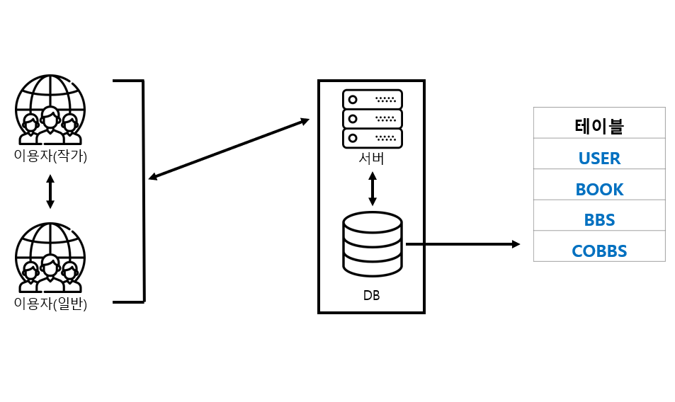

### 유즈케이스 다이어그램

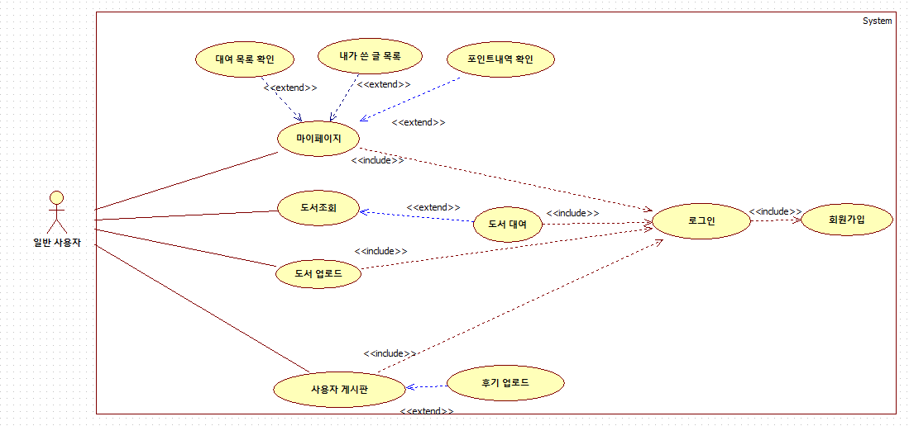

### 시퀀스 다이어그램

#### 시퀀스 다이어그램세트
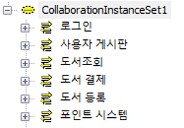
#### 시퀀스 다이어그램: 로그인
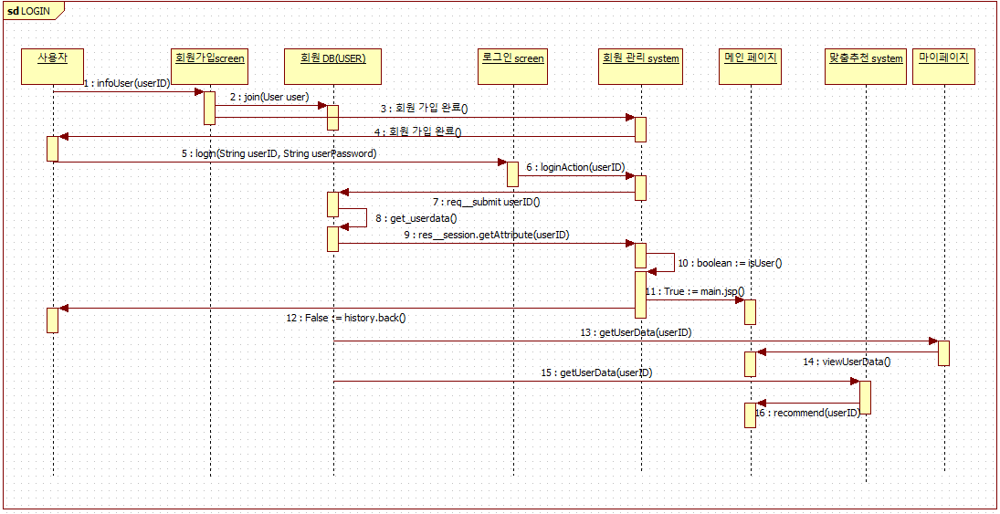
#### 시퀀스 다이어그램: 가입
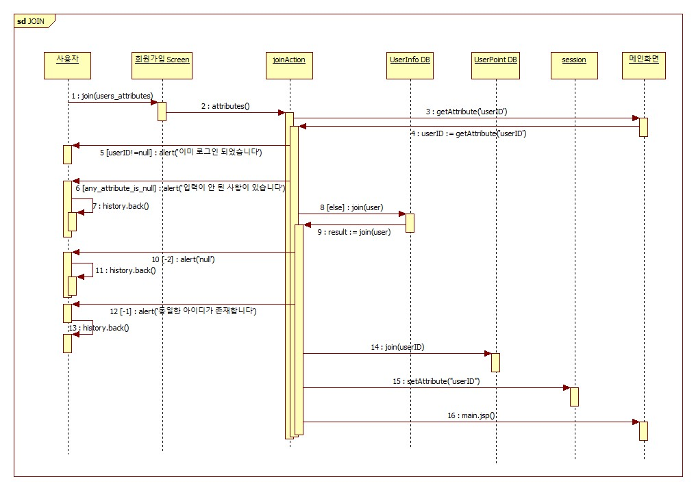
#### 시퀀스 다이어그램: 사용자게시판
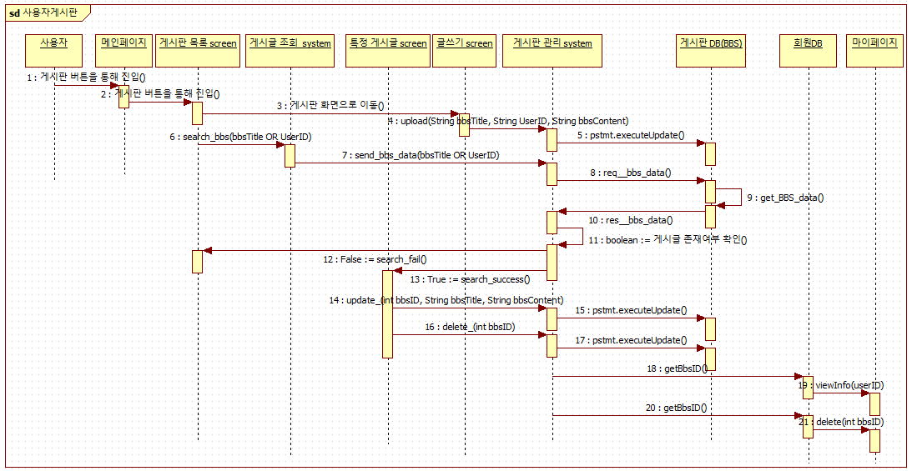
#### 시퀀스 다이어그: 도서 조회
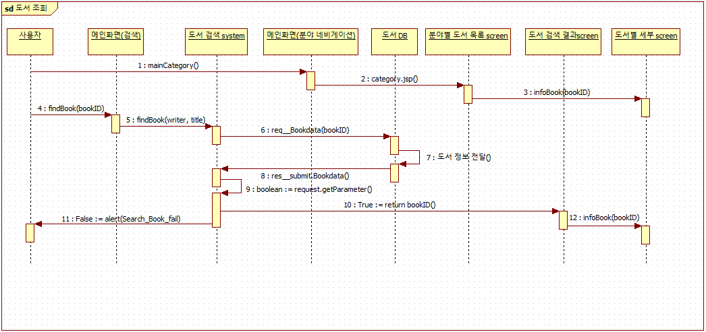
#### 시퀀스 다이어그램: 도서 결제
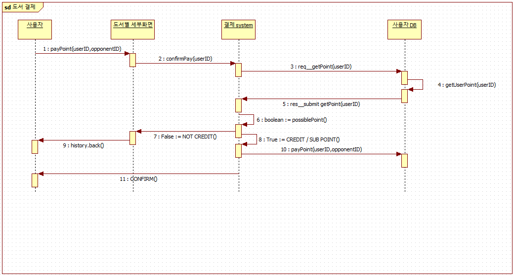
#### 시퀀스 다이어그램: 도서 등록
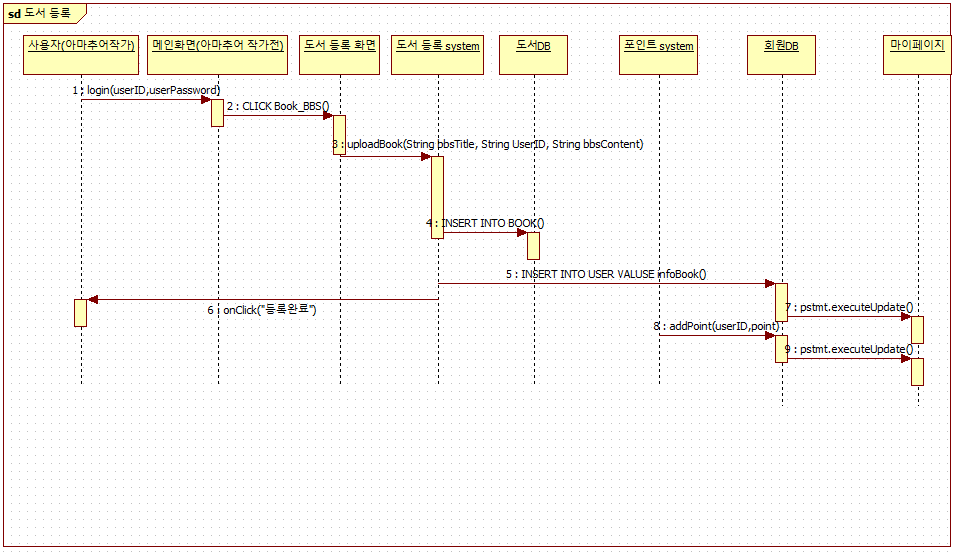
#### 시퀀스 다이어그램: 포인트 시스템
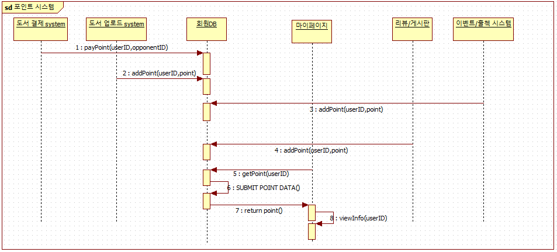
#### 클래스 다이어그램
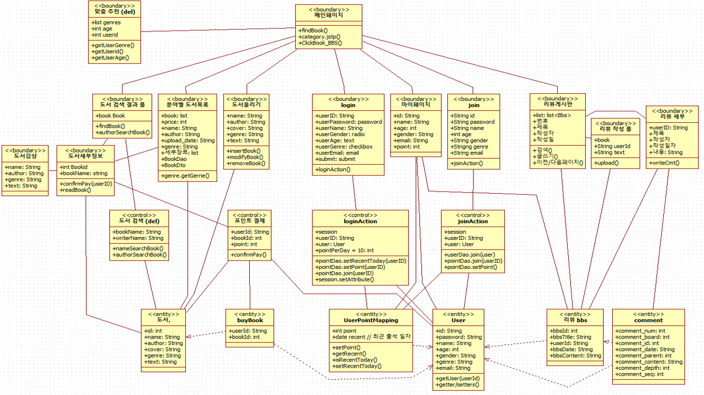

### 화면

#### 도서 카테고리 화면
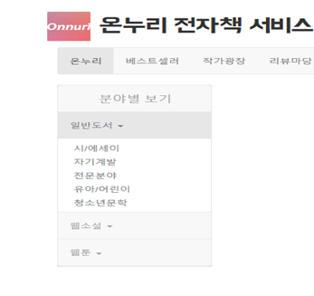
#### 도서 검색 화면
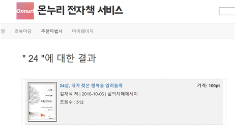
#### 도서 리뷰 글쓰기 화면
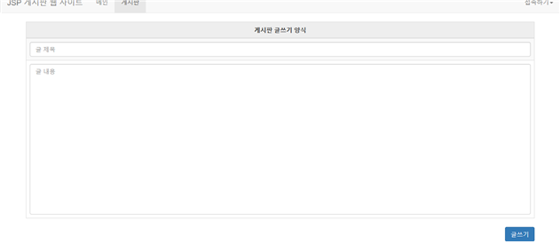
#### 마이페이지 화면
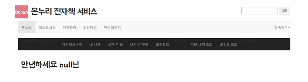
#### 메인화면 구체화 중
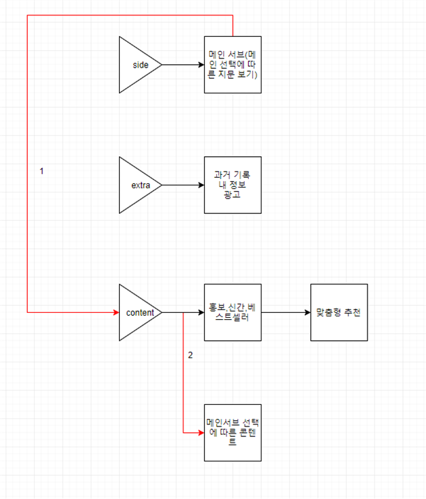
#### 알파 메인 화면
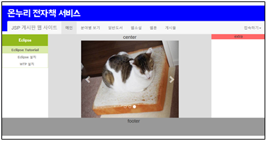
#### 프로토타입 메인 화면
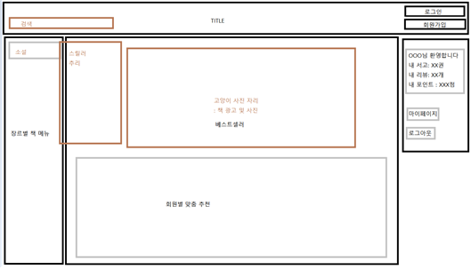

### 기타 산출물

- 요구사항 정의서
- 요구사항 회의록
- 제안요청서
- 발표자료
- 매 주차 회의록
